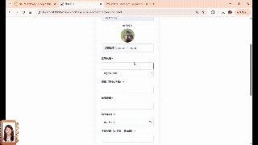
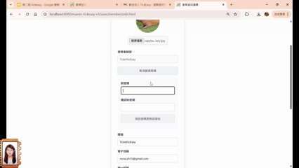

# 🎫 TickEasy 線上購票系統

TickEasy 是一個基於純 Java Web（Spring MVC + Servlet + JDBC）的線上購票專案，為2025年緯育Java在職專班的結訓專題。

---

## 📚 專案背景

- **專題緣起**：2025年緯育Java在職專班的結訓專題，旨在建立互動性高的演唱會平台，改善現行購票網站提醒不足、缺乏換票、黃牛氾濫等問題，提供即時通知與票券轉換功能。
- **個人貢獻**：
  前台開發：會員註冊登入、會員資料編輯、Email驗證(註冊驗證/更改密碼驗證)、會員權限辨別導向頁面
  後台開發：數據儀錶板(收入圓餅圖/銷售趨勢圖/橫向進度條)、報名人列表與明細
- **購票者帳號**：`buyer1` / 123456
- **管理者帳號**：`eventhost1` / 123456

---

## ⚙️ 功能模組

| 編號 | 模組                 | 說明                                                         |
| ---- | -------------------- | ------------------------------------------------------------ |
| 1    | **Member 會員管理**     | 登入／註冊／登出／編輯<br>JavaMail 驗證信<br> Token 認證      |
| 2    | **EventDetail 管理**    | Dashboard 資料彙總<br>報名人列表與明細 |
| 3    | 場次查詢               | 多條件搜尋（日期、場館、演出）並即時顯示剩餘座位               |
| 4    | 線上購票               | 互動式座位圖選座<br>Redis 分布式鎖 + 資料庫悲觀鎖              |
| 5    | 訂單管理               | 建立／查詢／取消／退票<br>Spring 事務與事件機制                |
| 6    | 即時通知               | WebSocket 推播<br>                   |

---

## 🚀 演示（Demo）

- **會員註冊／驗證**  
  
  
- **Dashboard 摘要**  
    
- **參與者列表**  
    

---

## 🛠️ 技術棧

- **後端**：Java 8、Spring MVC、Servlet API  
- **安全**：JavaMailSender  
- **資料庫**：JDBC + HikariCP、MySQL、Redis
- **前端**：JSP + JSTL、jQuery、Bootstrap、Ajax、WebSocket (STOMP)  
- **部署**：Tomcat 8.5 / Heroku

---

## 📂 專案結構

```text
TickEasy/
├─ src/
│  ├─ main/
│  │  ├─ java/com/tickeasy/
│  │  │    ├─ controller/
│  │  │    ├─ service/
│  │  │    ├─ dao/
│  │  │    ├─ entity/
│  │  │    ├─ filter/
│  │  │    └─ util/
│  │  └─ resources/
│  │       ├─ jdbc.properties
│  │       └─ application.properties
│  └─ webapp/
│      ├─ pages/
│      └─ WEB-INF/
└─ pom.xml
